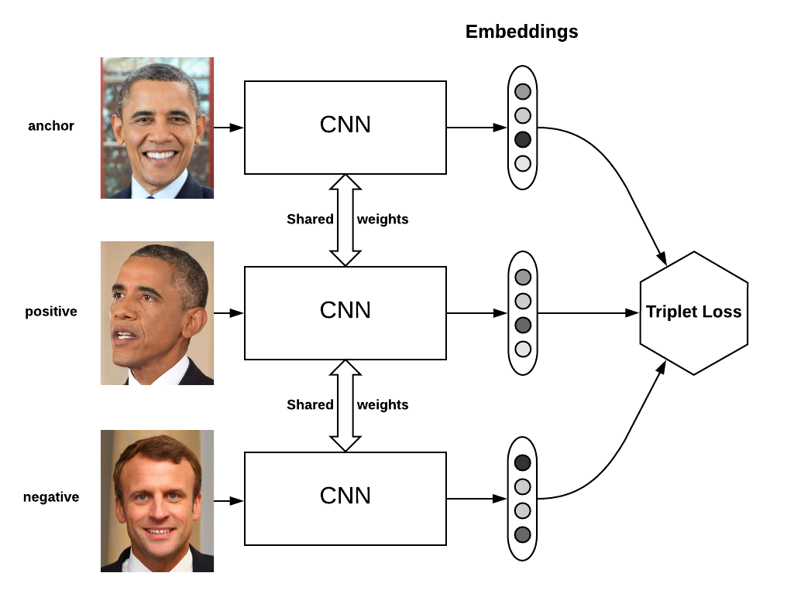

# Triplet Loss on Iris
## _Easy Implementation of Triplet Loss Training on Iris_ 

 In this repo, we attempted to implement triplet loss on Iris Dataset, 
 we used simple fc networks
- Training with Cross Entropy (Really Basic)
- Training with Triplet Loss
-  Training with Triplet Loss & Cross Entropy

## Features
    
- Triplet pairs Sampling
- Triplet Loss Implementation

### Note
This experiment is done on !reallyreally! simple Iris data, I cannot conclude triplet loss+entropy is always better than entropy.

When we are training with triplet loss, we focused on how three labels get separated. Therefore, intermediate layer fc into '2' is for easy plotting. However, one could try with higher dimension and apply TSNE techniques

### To Do

- Edit ReadMe
- Add some pictures

## Reference

Classifying Iris with PyTorch https://janakiev.com/blog/pytorch-iris/

Explanation of Triplet Loss https://medium.com/vitrox-publication/understanding-circle-loss-bdaa576312f7

FaceNet: A Unified Embedding for Face Recognition and Clustering https://arxiv.org/abs/1503.03832